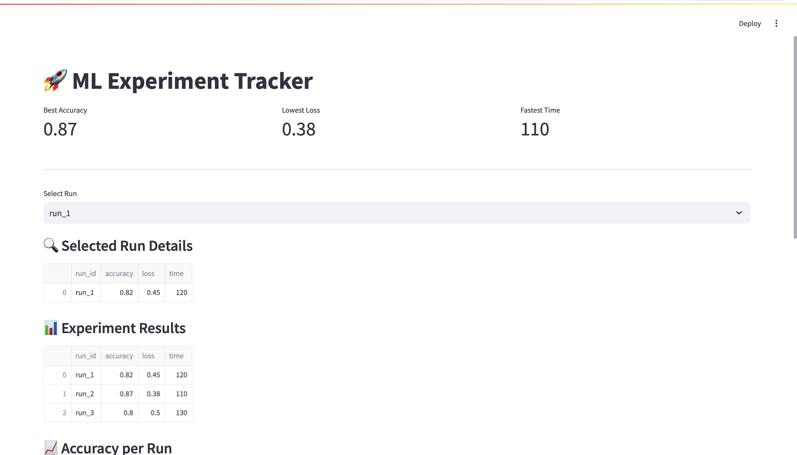

# 🚀 ML Experiment Tracking Dashboard

## 📌 Problem
Machine learning experiments generate multiple runs with metrics like accuracy, loss, and runtime.  
Tracking and comparing them manually becomes messy and inefficient.

## 💡 Solution
This project provides an interactive dashboard to:
- Track multiple experiment runs
- Compare model performance
- Identify best-performing models quickly

---

## 🛠 Tech Stack
- Python
- Streamlit
- Pandas
- Matplotlib / Plotly (if used)

---

## ▶️ How to Run

```bash
git clone https://github.com/rohinimallik572-svg/ml-experiment-dashboard.git
cd ml-experiment-dashboard
pip install -r requirements.txt
streamlit run app.py

## 📸 Dashboard Preview
(Add screenshot here)
